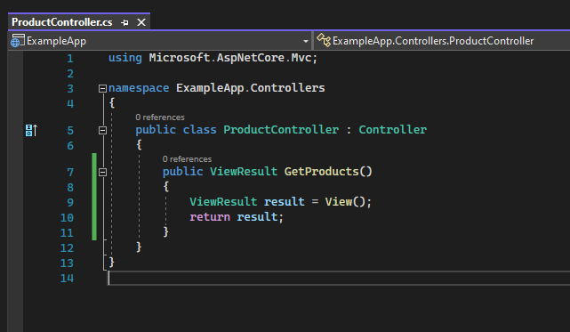
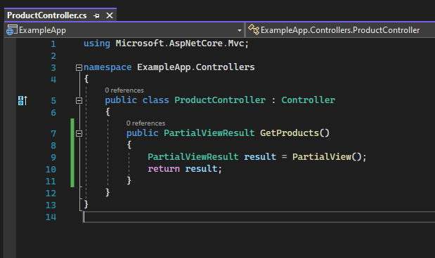
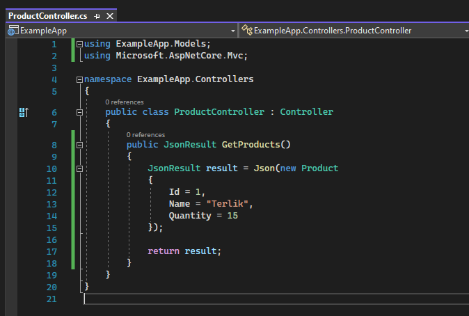
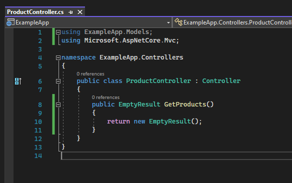
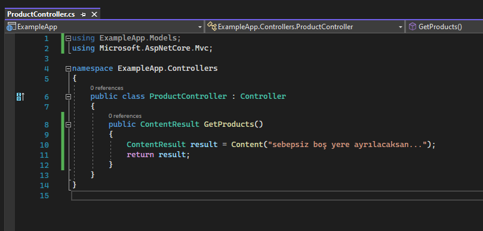
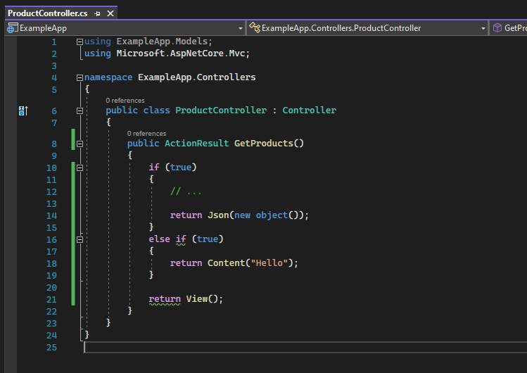

# Action Türleri

## ViewResult

Response olarak bir view dosyasını (.cshtml) render etmemizi sağlayan action türüdür.

  

## PartialViewResult

Yine bir view dosyasını (.cshtml) render etmemizi sağlayan action türüdür.

ViewResult'tan temel farkı, client tabanlı yapılan Ajax isteklerinde kullanıma yatkın olmasıdır.   

Yani client'tan yapılan istek client tabanlı değilse ViewResult kullanılır. Yok eğer client tabanlıysa, ajax teknolojisiyle bu işlem gerçekleştiriliyorsa PartialViewResult kullanılır.

Bunu şu şekilde tahayyül edebiliriz: Web sayfasının genelini bize oluşturan ViewResult'tur. Ancak web sayfasındaki belirli bir noktayı, parçayı oluşturacak olan PartialViewResult'tur.

Aralarındaki teknik fark ise ViewResult, _ViewStart.cshtml dosyasını baz alır. Lakin PartialViewResult ilgili dosyayı baz almadan render eder.

Yani ViewResult genel sayfayı render ederken PartialViewResult genel sayfayı değil belirli bir alanı render edip onun çıktısını o alanda kullanır. 

  

## JsonResult 

Üretilen datayı json türüne dönüştürüp döndüren bir action türüdür. Genellikle ajax tabanlı işlemlerde kullanılır.

  

## EmptyResult

Bazen gelen istekler neticesinde herhangi bir şey döndürmek istemeyebiliriz. Böyle bir durumda EmptyResult action türünü kullanabiliriz.

Ancak bunu cevapsız gibi düşünmeyelim. Bir response dönderiliyor ancak result'ı yok, adı üzerinde boş result.

  

## ContentResult    

İstek neticesinde cevap olarak metinsel bir değer döndermemizi sağlayan action türüdür. Genellikle ajax tabanlı işlemlerde kullanılır.

  

## ViewComponentResult

İsteğe cevap olarak bir ViewComponent render etmemizi sağlayan action türüdür.

 

## ActionResult

Bütün result türlerinin atasıdır. Tüm action türlerini karşılayan ana türdür.

Gelen bir istek neticesinde geriye döndürülecek action türlerinin değişkenlik gösterebildiği durumlarda kullanılan bir action türüdür. 

Örneğin istek geldi ve bu istek üzerinde if'lerle switch'lerle kontrol yapıyoruz. Yapmış olduğumuz kontrol neticesinde geriye json döndürmemiz gerekebilir, content döndürmemiz gerekebilir, partial döndürmemiz gerekebilir... İşte bu geri dönüşlerin hepsini tek bir fonksiyonda döndürebilmemiz için bunların ortak bir türe ihtiyacı vardır. O türde ActionResult türü olacaktır.  

Yani ActionResult ortak bir tür sağlamış oluyor.

  

## IActionResult

IActionResult, ActionResult'ın bir arayüzüdür. IActionResult'ıyla da bütün action'ları karşılayabiliriz.  

