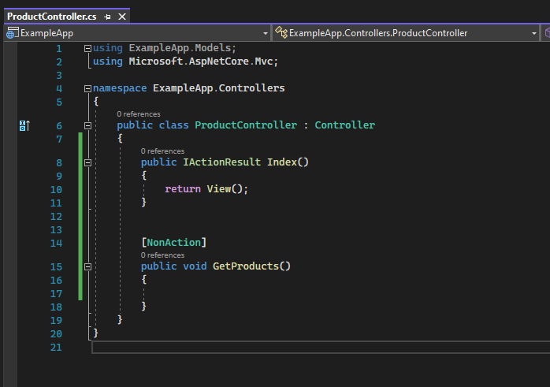
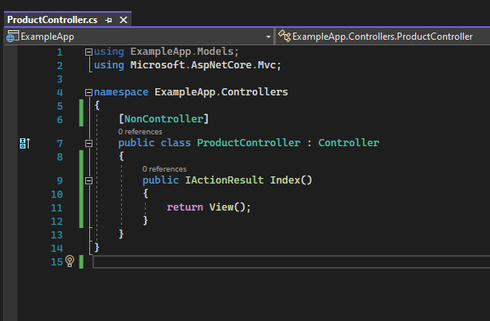

# Controller Attribute'ları 

Controller'ın temel, yegane amacı; sadece request'leri karşılamaktır.

Yani controller dediğimiz sınıf kendi içerisinde bir iş mantığı, algoritma yürütmemelidir.  

Sadece request'i karşılamalı ve bu request'in gereği olan algoritmaları, servisleri tetiklemelidir. 

Controller, işin komutanıdır. İşi yapanı değildir. İş mantığının; başka yerlerde, başka servislerde, başka sınıflarda tanımlanmış olması gerekiyor.

Örneğin; hepsiburada.com'a ayın kampanyalı ürünlerini getirmesi için bir istekte bulundunuz. Controller, ilgili isteği karşılar ancak bu istek neticesinde ayın kampanyalı ürünlerini getirme işini controller yapmaz. Bu işi yapacak olan servise yönlendirmede bulunur.  

Yani burdaki operasyonel çalışma kesinlikle controller sınıfında olmaması gerekiyor. İdeal tasarım budur. 

Controller; kontrol edendir, işi yapan değil.

 

## NonAction Attribute

Controller içerisinde NonAction attribute'u ile işaretlenen fonksiyonlar dışarıdan request almazlar. 

Sadece operatif / algoritma barındıran / iş mantığı yürüten bir metot haline gelmiş olur.

  

## NonController Attribute

Controller seviyesinde kullandığımız bir attribute'dur. 

Sistemde var olan bütün controller'lar dışarıdan istek alabilmektedir. 

Eğer hem controller tanımlayıp hem de dışarıdan istek almasını istemiyorsak ilgili controller'ı NonController ile işaretleyebiliriz. 

Artık bu controller, normal bir sınıf işlevi görecektir.

