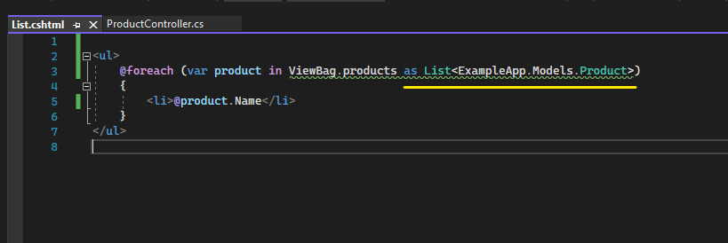

# View Yapılanması

## View Nedir?

View; controller'da üretilen verinin js, css ve bunun gibi UI teknolojilerinin kullanılarak görselleştirildiği, render edildiği bir katmandır. 

C#'ı kullanarak UI tabanlı çalışmamızı sağlayan yani html içerisinde c# kodlarını yazmamızı sağlayan asıl teknoloji razor teknolojisidir. Microsoft tarafından geliştirilmiştir.   

View, uzantısı .cshtml olan bir dosyadır. Ve bu dosya her ne kadar web'de çalışıyor olsakta web terminolojisinde evrensel bir yapılanma değildir. 

Bunu örnek vererek açıklayacak olursak; html web terminolojisinde evrenseldir. Css evrenseldir. Js evrenseldir. Yani biz bunları  herhangi bir platformda kullanabiliriz. Ancak .cshtml evrensel değildir. Sadece asp .net core'a aittir, asp .net core'da çalışır. 

View dosyalarını render ettikten sonra c# kodlarını göremeyiz. Çıktı olarak sadece html verecektir.    

 

## Views Klasörü

Bir projede view dosyaları genellikle Views klasörü altında bulunurlar.

Neden genellikle burada bulunurlar peki? Çünkü asp .net core mimarisinde mvc'de action'lar, karşılıkları olan view dosyalarını belirli bir format üzerinden bulmaktadır. 

Yani view klasörünün altında, controller isminde bir klasör vardır. Ve onun altında da action isimlerine karşılık gelen .cshtml uzantılı dosyalar ilgili action'ın view dosyası olarak direkt, default olarak kabul edilirler. Mimari bu şekilde çalışmaktadır.

Bu yüzden view'lerimizin Views klasörü altında olması gerekiyor. Ancak bu şart değildir. Views klasörü dışında başka bir isimle klasörümüzü isimlendirip varsayılanın dışına çıkabiliriz ama bu geleneği, standartı yine de bozmamalıyız. 

 

## Controllers - Views Veri Taşıma

Controller'dan View'e 4 farklı şekilde veri gönderebiliriz. Bu dört farklı şeklin biri model bazlı veri göndermekken diğer üçü veri taşıma kontrolleri ile veri göndermektir. 

Model bazlı veri göndermeyle beraber biz ekstradan kullanıcıdan veri alabilirken veri taşıma kontrolleri ile sadece controllerdan view'e veri gönderme operasyonlarını gerçekleştirebiliyoruz.

 

* ### Model Bazlı Veri Gönderimi

Eğer bir veriyi view'e model bazlı göndereceksek View fonksiyonunun model overload'ını kullanmamız gerekmektedir.

View() fonksiyonuyla model'ı yani verimizi view'e gönderiyoruz.

Ve view'de bu gelen veriyi şu şekilde kontrol ediyoruz: 

1- İlk öncelikle object türünde gelen verinin türünü <strong>@model</strong> keyword'ü ile belirliyoruz. 

2- Gelecek olan data'yı kullanabilmek için de <strong>@Model</strong> keyword'ünü kullanıyoruz. Bu keyword, @model ile bildirilen türe bürünüyor ve o türdeki data'yı yakalıyor.  

>> Resimde altı çizili olarak belirtilen <strong>@</strong> keyword'ünü c# kodlarını yazabilmek için kullanıyoruz!

 

* ### Veri Taşıma Kontrolleri

<h4 style="margin-top:30px">
1- ViewBag 
</h4>

View'e gönderilecek / taşınacak data'yı dynamic şekilde tanımlanan bir değişkenle göndermemizi sağlayan bir veri taşıma kontrolüdür. 

Dynamic türünde olan ViewBag property'si ile data'yı view katmanına göndeririz.

Ve resimde altı çizili olan ifade bir değişkendir. Bu değişkene products listemizi atadık. 

View() fonksiyonu veriyi, ViewBag.products değişkeniyle view'e gönderecektir.

Controllers'dan gelen ViewBag.products değişkenini yine aynı konseptle view'de karşılıyoruz.

Ancak ViewBag.products değişkeni dynamic türünde olduğu için derleme aşamasında verinin türü bilinmez. 

Bu sebepten ötürü de biz derleme aşamasında veri üzerinde işlem yapabilmek / verinin elemanlarına ulaşabilmek için as veya cast operatörü ile verinin türünü bildirmiş oluruz. 

Eğer verinin türünü bildirmezsek derleme aşamasında elemanlara ulaşamazken;

Türü bildirdiğimizde verinin elemanlarına ulaşabiliriz;

Yani burda tür bildirme işlemi opsiyonel bir şeydir. Eğer elemanlara ulaşmak istiyorsak as veya cast operatörlerinden birini kullanmamız gerekirken elemanlara ulaşmak istemiyorsak bu operatörleri kullanarak tür bildirimi yapmamıza gerek yoktur.

 

<h4 style="margin-top:30px">
2- ViewData
</h4>

ViewBag'de olduğu gibi action'daki datayı view'e taşımamızı sağlayan bir kontroldür. 

Peki ViewBag ile ViewData arasındaki fark nedir?

ViewBag, ilgili data'yı dynamic ile view katmanına taşırken; ViewData, ilgili data'yı boxing ederek view'e  taşır.

Dolayısıyla ViewData ile gönderdiğimiz veriyi view'de kullanabilmek için unboxing etmeliyiz. 

ViewData'da ViewBag gibi çalışmaktadır. View() fonksiyonuyla veriyi, object türündeki ViewData property'si ile göndeririz.

Ancak view katmanına gönderilen boxing edilmiş veriyi kullanabilmek için as veya cast operatörleriyle unboxing etmek zorundayız. 

  

<h4 style="margin-top:30px">
3- TempData
</h4>

TempData'da, ViewData'da olduğu gibi action'daki veriyi boxing'e tabi tutarak view'e göndermemizi sağlar.

Dolayısıyla TempData'da da gönderdiğimiz veriyi view'de kullanabilmek için unboxing etmeliyiz.

Peki TempData ile ViewData arasındaki fark nedir?

Biz, action'ları kendi aralarında yönlendirebiliyoruz. Örneğin; bir action'ın operasyonu bittikten sonra kullanıcıya herhangi bir response göndermeden önce başka bir action'a yönlendirme yapabiliyoruz. O action'daki operasyonların da gerçekleştirilmesini sağlayabiliyoruz. 

Böyle bir durumda, farklı bir action'a yönlendirme söz konusu olduğunda ViewBag veya ViewData ile diğer action'a veri taşıyamazken TempData ile veri taşıyabiliriz. 

Çünkü TempData arkaplanda bir cookie kullanıyor ve bu cookie sayesinde TempData ilgili veriyi hedef action'a taşıyabiliyor. 

Bu yüzden yönlendirme yaptığımız zamanlarda bir action'da elde edilen data'yı farklı bir action'a göndermek istiyorsak burada TempData'yı kullanmamız gerekir. Aksi taktirde diğer veri taşıma kontrolleri ile action'lar arasında veri taşıyamayız.

RedirectToAction() metoduyla hangi action'a yönlendirme yapacağımızı bildirmiş oluyoruz. Eğer bu controller'ın dışında başka bir controller'ın içerisindeki action metoda yönlendirme yapmak istiyorsak yine bu metodun overload'unu kullanabiliriz. 

Get() action'ından gönderilen veriyi Update() action'ında bu şekilde kullanabiliriz.

 

TempData, cookie değeri üzerinden veriyi taşıyor. Haliyle cookie'ye ilgili verinin dönüştürülmesi yani serilize edilmesi  gerekir. Basit türleri serilize etmede bir sıkıntı yok ancak komplex type'da çalışıyorsak komplex type'ı serilize etmek ekstradan bir maliyet olduğu için uygulama hata verecektir.

TempData'da bu şekilde kompleks bir data kullanırsak veri serilize edilemediği için çalışma zamanında hata alırız.

Bu hatanın önüne geçebilmek için veriyi serilize ederek göndermemiz gerekecektir. Bunun içinde JsonSerializer adındaki kütüphaneyi kullanmalıyız. 

Serilize ettiğimiz data'yı string türünde elde ediyoruz. Ve bu elde ettiğimiz data'yı TempData ile diğer action'a gönderiyoruz.

Daha sonrasında Update() metoduna gelen veriyi kullanabilmek için deserilize etmemiz gerekmektedir. Ancak veri TempData tarafından boxing edilerek gönderildiği için ve deserilize etme işleminde data'yı string formatta kullanmamız gerektiği için öncelikle bu datayı string'e dönüştürüyoruz sonrasında deserilize ediyoruz.

