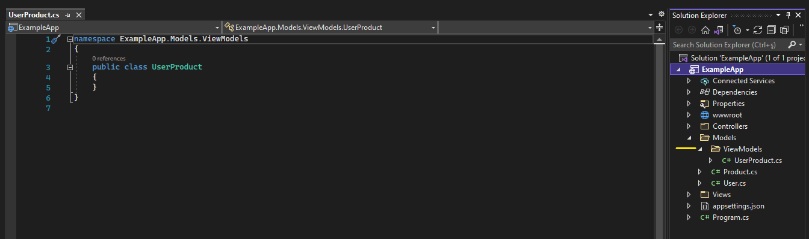
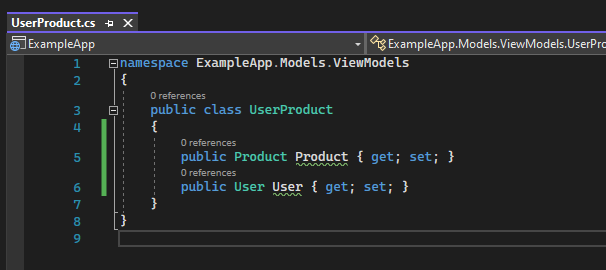
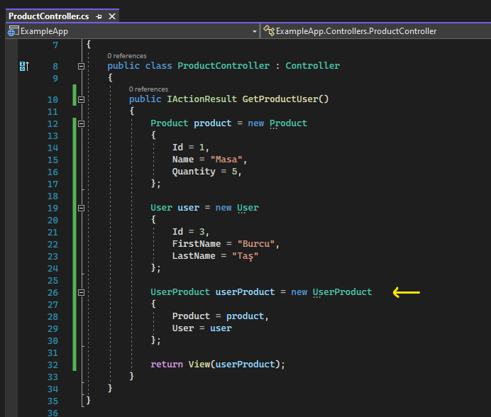
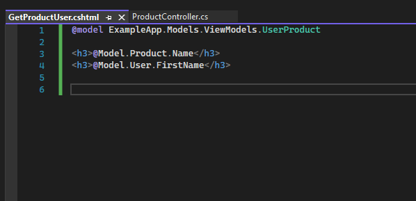
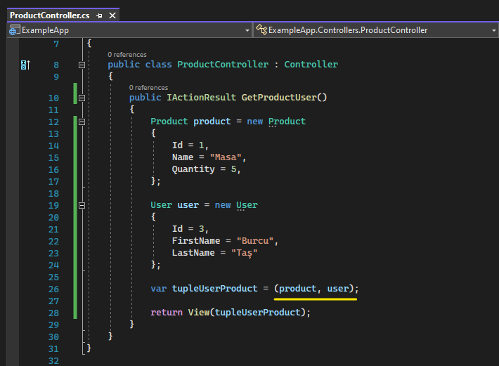
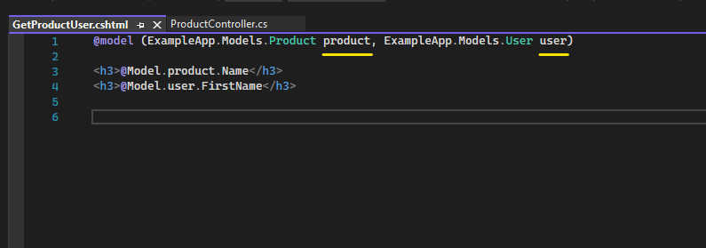

# View'e Tuple Nesne Gönderimi ve Kullanımı
## Tuple Nedir?

Tuple, içerisinde birden fazla değeri / nesneyi referans edebilen nesnelerdir.

 

Birden fazla veriyi ya da nesneyi bir bütün olarak kullanabilmek için ViewModel dediğimiz model'ları da kullanabiliriz. Örneğin, product ve user varlıklarımız olsun. Product nesnesiyle user nesnesi için bir tane ViewModel oluşturuyoruz. Ve içerisine product referansıyla user referansını koyuyoruz. Ve ilgili nesneleri bu referanslar üzerinden referans ediyoruz.

Dolayısıyla birden fazla değeri tek bir nesne üzerinden referans etmek istiyorsak ViewModel'ı da kullanabiliriz tuple yapısını da. 

 

## View Model ile nesnelerimi View'e Nasıl Taşıyabilirim?

Öncelikle Models klasörünün altında ViewModels adında bir klasör oluşturuyoruz.

Ve View'e göndermek istediğimiz birden fazla nesnenin isminde bir class oluşturuyoruz.

Daha sonrasında bu class'a, ViewModel'ın referans edeceği nesneleri property ile ekliyoruz.

Artık oluşturduğumuz ViewModel class'ı ile nesnelerimizi view katmanına gönderebiliriz. 

  

Model olarak gönderdiğimiz userProduct'ı view katmanında da model bazlı veri gönderimine uygun bir şekilde karşılamalıyız.

  

## Tuple ile nesnelerimi View'e Nasıl Taşıyabilirim?

View'e taşımak istediğimiz nesneleri aşağıda da görüldüğü üzere virgüllerle ayırarak bildiriyoruz.

Daha sonrasında ViewModel'da da olduğu gibi Model olarak gönderdiğimiz tupleUserProduct nesnemizi view katmanında model bazlı veri gönderimine uygun bir şekilde karşılıyoruz.

View katmanında tuple nesnemizi karşılarken tuple'ın içerisindeki nesnelerin türlerini parantez içerisinde bildirmeliyiz. 

Ve bu nesnelere @Model ile ulaşmak istediğimizde her bir nesneye otomatik olarak Item1, Item2, Item3... şeklinde isimlendirme yapılacak.

Eğer bu isimlendirme yerine anlamlı bir isim vermek istiyorsak resimde altı çizili şekilde gösterildiği gibi kendi isimlendirmemizi yapabiliriz.

