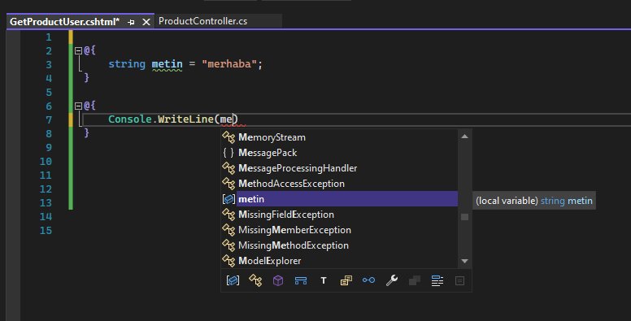
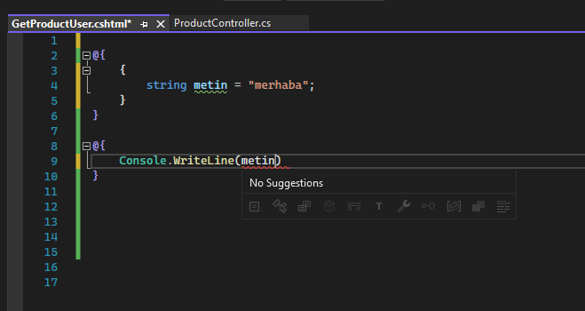
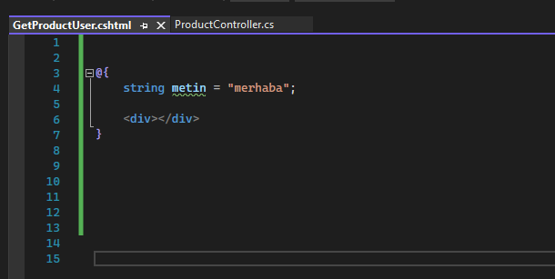
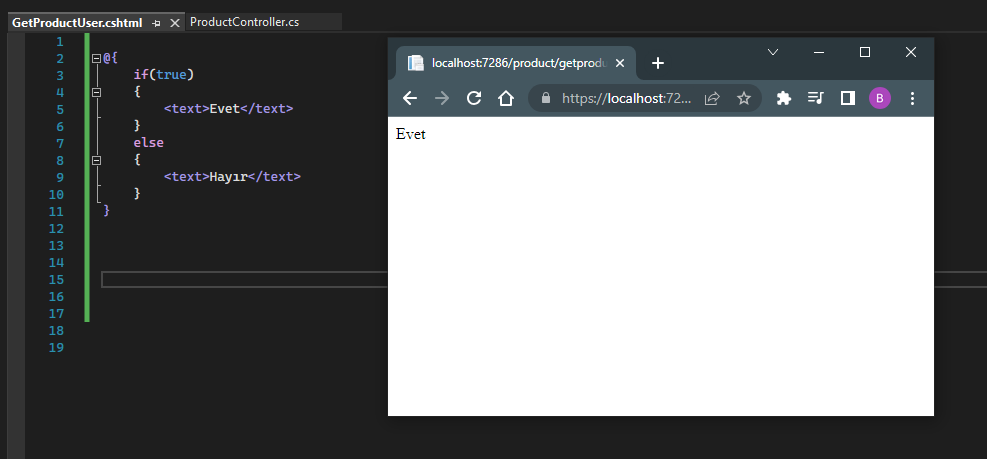
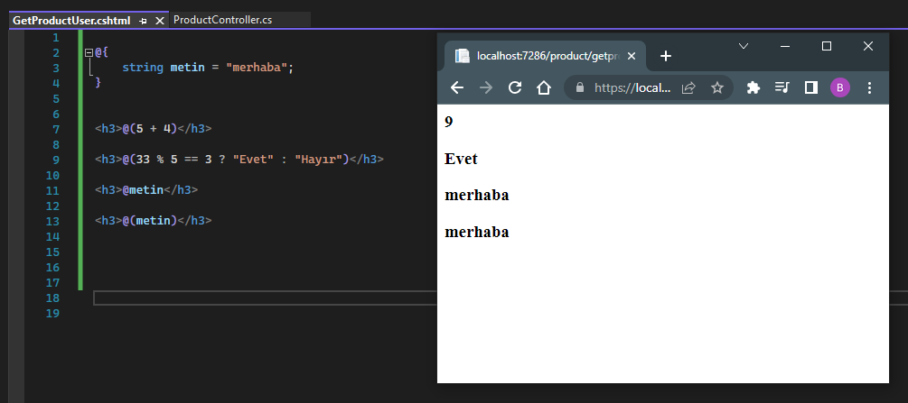
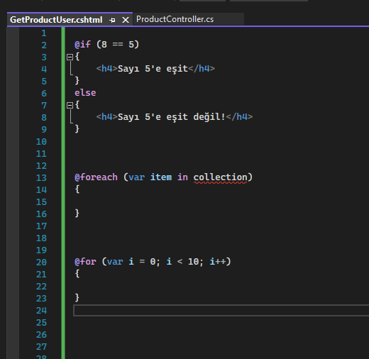

# Razor Nedir?
<p>
Asp .Net Core Mvc mimarisinde .cshtml dosyasında html ile birlikte  c# kodları yazabilmemizi sağlayan ve bu kodları server'da çalıştırmamızı  sağlayan bir teknolojidir.
</p>
<p>
Microsoft tarafından geliştirilmiştir. Asp .net'de UI tabanlı çalışmalarda c#'ı kullanmamızı sağlayan teknolojidir.
</p>
<br>

## Yorum Satırı
<p>
<strong>@</strong> operatörü, razor operatörüdür. Yani .cshtml içerisinde @ dediğimiz yerde c# kodlarımızı yazabiliyoruz.  
</p>
<p>
Razor teknolojisinde yorum satırı oluşturabilmemiz için @**@ şeklinde bir syntax kullanmamız gerekecektir. Bu sayede yazdığımız notlar program tarafından derlenmeyecektir.
</p>

``` 
@* yorum satırı *@
```
<br>


## Razor ile Değişken Oluşturma
<p>
Razor'da değişken oluşturabilmemiz için @ operatörüyle scope'larımızı oluşturmamız yeterlidir. 
</p>

```
@{

}
```
<p>
Bu syntax'ın içerisine c# kodlarımızı yazabiliriz.
</p>
<br>
<p>
Aynı derecede olan başka bir scope'un içerisindeki değişkenlerimize ulaşabiliriz. Çünkü aynı derecedeki bu scope'lar derleme anında tek bir scope içerisine alınıyor. 
</p>

<br><br>
<p>
Amma velakin farklı derecelerdeki scope içerisindeki değişkenlere ulaşamayız. 
</p>

<br><br>


## Razor İçerisinde Html Kullanımı
<p>
@ operatörüyle yazdığımız c# kodlarının içerisinde html tag'larını kullanabiliriz.
</p>

<br><br>


## Razor İçerisinde &lt;text&gt; etiketi
<p>
Eğer c# kodları içerisinde belirli bir metinsel değeri html'e basmak istiyorsak &lt;text&gt; etiketini kullanabiliriz.
</p>

<br><br>


## Razor İle Tek Satırlık İşlemler
<p>
Eğer razor dosyamızda tek satırlık bir işlem yapılacaksa @() syntax'ını kullanmalıyız.
</p>

<br><br>


## Razor Scope Kullanımı 
<p>
Razor teknolojisi yapısal olarak her ne kadar c# scope'u oluşturmamızı sağlasa da konseptli yapılanmalarda yani kendi scope'u olan yapılanmalarda (if gibi döngüler gibi) scope oluşturmamıza gerek kalmıyor. 
</p>
<p>
Yani razor, ilgili yapılanmanın scope'unu kullanabilen bir teknolojidir. 
</p>
<p>
Örneğin;
</p>



