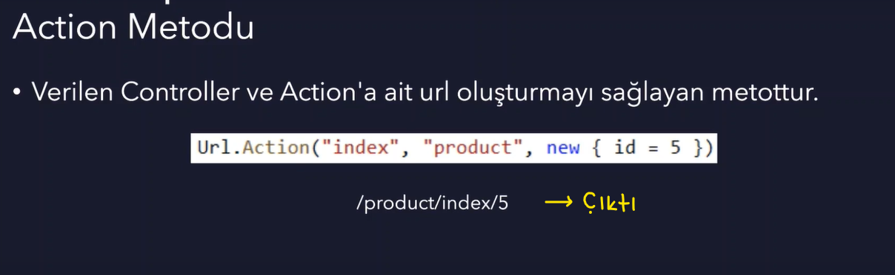
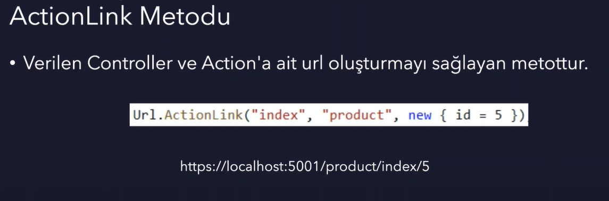
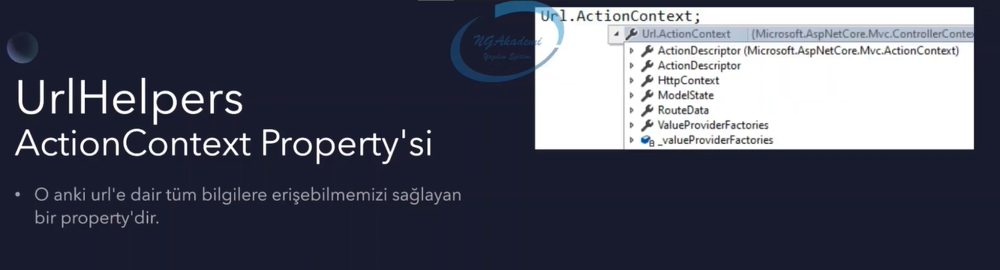
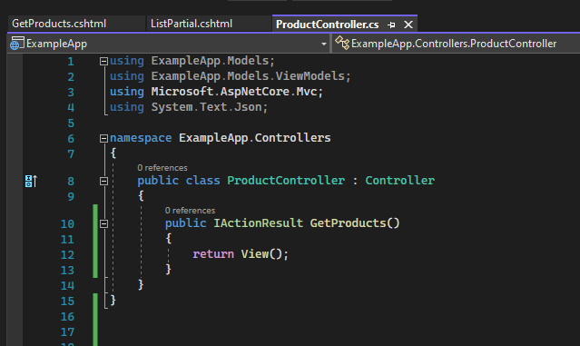
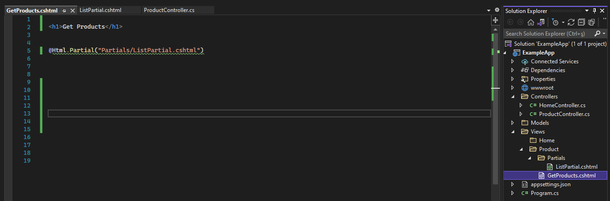
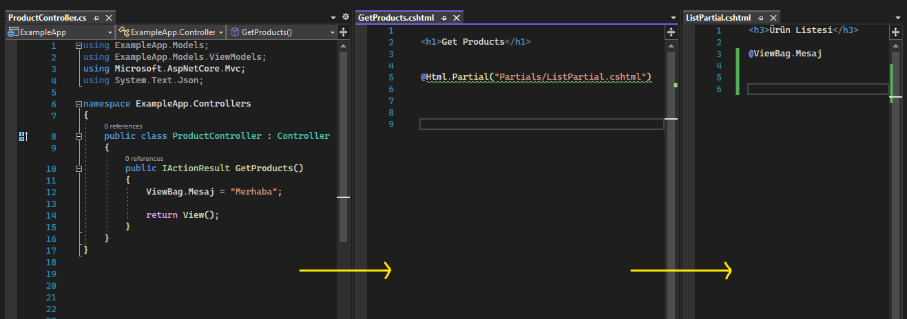
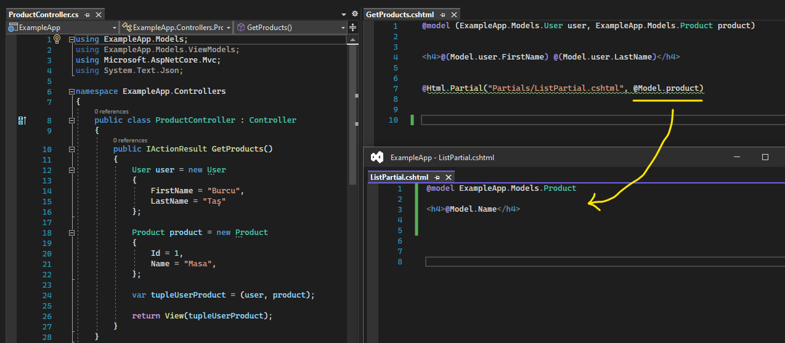
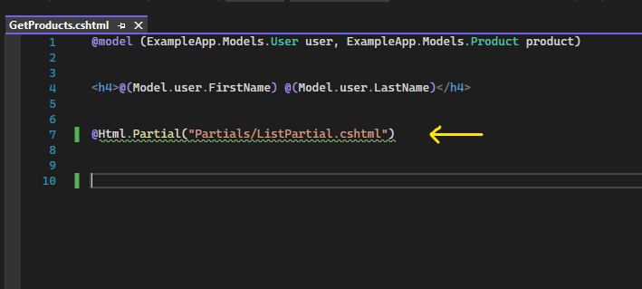
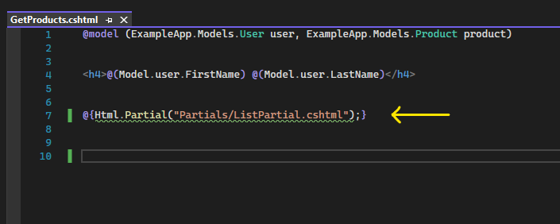

# Helpers

Helpers yapılanmaları, yardımcı metotlardır. Üç tane helper fonksiyonu vardır: UrlHelper, HtmlHelper, TagHelper.

  

## 1- UrlHelper 

Asp .Net Core Mvc uygulamalarında url oluşturmak için yardımcı metotlar içeren ve o anki url'e dair bizlere bilgi veren bir sınıftır.

### UrlHelper Metotları
* 
Action

* 
ActionLink

* 
Content

* 
RouteUrl

### UrlHelper Property'leri
* 
ActionContext

 

### A- Action Metodu

Verilen controller ve action'a ait bir url oluşturmayı sağlayan metottur. Yani bir link oluşturacaksak eğer bu linki manuel'de oluşturabiliriz UrlHelper'ı kullanarak da oluşturabiliriz.

  

### B- ActionLink Metodu

Verilen controller ve action'a ait bir url oluşturmayı sağlayan metottur. Action metotla aralarında çok fazla bir değişiklik yoktur. Aralarındaki tek fark; oluşturulan url'de temel host bilgisi, protokolü ve port bilgisini barındırılır.     

  

### C- Content Metodu

Genellikle css ve javascript gibi dosya dizinlerini programatik olarak tarif etmek için kullanırız. 

Bu metot çokta önemli değil. Önemli olmamasının sebebi ise; UseStaticFiles middleware ile gelen static dosya yapılanması bu metodun işlevselliğini daha efektif üstlenmektedir. 

 

### D- RouteUrl Metodu

Mimaride tanımlı olan Route isimlerine uygun bir şekilde url oluşturan bir metottur.

  

### E- ActionContext Property

O anki url'e dair tüm bilgilere erişmemizi sağlayan bir property'dir.

   

## 2- HtmlHelper 

Html etiketlerini server tabanlı oluşturmamızı sağlayan yardımcı metotları barındırmaktadır.

Hedeflenen .cshtml dosyalarını render etmemizi sağlamaktadır.

O anki context'e dair bilgi edinmemizi sağlamaktadır. 

Veri taşıma kontrollerine erişmemizi sağlamaktadır.

### HtmlHelper Metotları
* 
Html.Partial

* 
Html.RenderPartial

* 
Html.ActionLink

* 
Html Form Metotları

### HtmlHelper Property'leri
* 
ViewContext

* 
TempData

* 
ViewData

* 
ViewBag

 

### A- Html.Partial Metodu

Hedef view'i render etmemizi sağlayan bir fonksiyondur.

Yani herhangi bir view'in içerisinde Html.Partial ile başka bir view'i render edebiliyoruz.

Örneğin; ProductController'ın içerisindeki GetProducts() action'ının view'inde başka bir view olan ListPartial.cshtml view'ini çağırabiliyoruz.

 

Eğer ki en sondaki view'in (mesela bu örnekte ListPartial.cshtml'in) bir data'ya ihtiyacı varsa, bu data'yı controller ile vermemiz gerekiyor.

Data, ilk öncelikle ilgili action'ın view'ine gönderilir daha sonra bu view'in tetiklediği hedef view'e gönderilir.  

  

#### Kritik

Eğer ki GetProducts() view'ine User nesnesini model bazlı gönderirsem ListPartial view'inde de bu model'ı kullanabilirim. Bu zaten normal şartlardaki durumdur. Ancak ben ListPartial'da User nesnesini değil de başka bir nesneyi örneğin Product nesnesini kullanmak istiyorsam Html.Partial metodunun overload'unu kullanmalıyım.

Yani GetProducts view'inde User nesnesini, ListPartial view'inde ise Product nesnesi gibi farklı nesneleri kullanmak istiyorsam bunun için Html.Partial'da küçük bir değişiklik yapmalıyım.

  

### B- Html.RenderPartial Metodu

Hedef view'i render etmemizi sağlayan bir fonksiyondur.

Bu metodun Html.Partial'dan farkı; 

Html.Partial'da hedef view'i direkt razor operatörüyle bildirirken Html.RenderPartial'da razor operatöründen sonra süslü parantezleri de kullanmalıyız.

Html.Partial'da hedef view'i şu şekilde bildirirken:

  

Html.RenderPartial'da bu şekilde bildiririz:

  

Bu şekilde farklı bildirmemizin sebebi; partial geriye string döndürürken RenderPartial void döndürür. Bu yüzden bunu tetikleyebilmemiz için scope içerisinde c# kurallarıyla tetiklememiz gerekiyor.

İşlevsel olarak yani sonuç olarak bişey fark etmiyor. İkisinde de aynı sonucu alıyoruz. 

Ancak teknik olarak şöyle bir fark vardır;

Html.RenderPartial sayfanın TextWriter'ını kullandığı için (yani http response'u server'a yazdığı için) Html.Partial'a nazaran daha hızlı render işlemini yürütür. Dolayısıyla Html.RenderPartial daha performanslıdır.

 

### C- Html.ActionLink Metodu

Link oluşturur. Url.ActionLink'le birebir aynı amaca hizmet eder. Aralarındaki tek fark Html.ActionLink'de oluşturulan linki a tagında oluşturur. Çünkü bu Html Helper olduğu için bize html çıktısını verir.

 

### D- Html Form Metotları

Kullanıcıyla etkileşime girmemizi ve form ve input nesneleri oluşturmamızı sağlayan metotlardır. 

* 
Html.BeginForm
 
* 
Html.CheckBox
 
* 
Html.TextBox
 
* 
Html.Display
 
* 
Html.Password
 
* 
Html.Textarea
 
* 
Html.ValidationMessage
 

