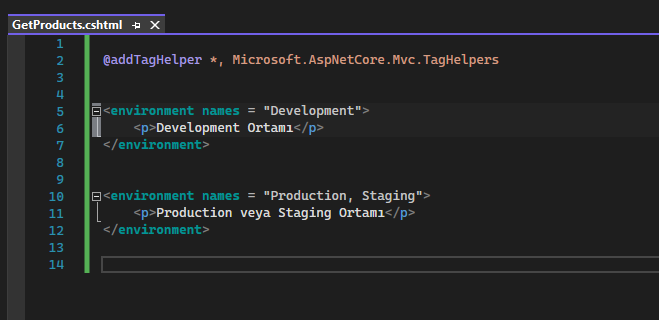

# TagHelper

TagHelpers; daha okunabilir, anlaşılabilir, kolay geliştirilebilir bir view inşa etmemizi sağlayan Asp .Net Core ile birlikte HtmlHelpers'ların yerine gelen yapılardır.  

 

## TagHelper vs HtmlHelper
* 
 TagHelper'lar view'lerdeki kod maliyetini oldukça düşürmektedirler.

 

* 
 TagHelper'lar, HtmlHelper'ların html nesnelerinin generate edilmesi server'a yüklemesinin getirdiği maliyetide ortadan kaldırmaktadır.

 

* 
 HtmlHelpers'lardaki programatik yapılanma, programlama bilmeyen tasarımcıların çalışmasını imkansız hale getirmekteydi. TagHelpers'lar ile buradaki kusur giderildi ve tasarımcılar açısından programlama bilgisine ihtiyaç duyulmaksızın çalışma yapılabilir nitelik kazandırdı.

 

* 
 HtmlHelpers ile oluşturulan html nesnesinin attribute'ları 'htmlAttribute' parametresi üzerinden anonim nesne ile verilmektedir. Bu durum hem bellek optimizasyonu açısından hem de kod maliyeti açısından oldukça zararlıdır. TagHelpers'lar bu maliyeti ortadan kaldırmakta ve html nesnelerine sadece ilgili attribute'ları normal sözdizimiyle vermekle ilgilenmektedir.

 

## TagHelper Entegrasyonu

TagHelper'lar özlerinde bir sınıf oldukları için belirli bir kütüphanenin içerisinde barındırılmaktadır.

TagHelper'ı kullanabilmemiz için öncelikle view'lere @addTagHelper diyerek Microsoft.AspNetCore.Mvc.TagHelpers kütüphanesini eklememiz gerekecektir. 

  

Yukarıdaki resimde işaret edilen yıldız sembolüyle TagHelpers kütüphanesindeki bütün sınıflara ulaşmak istediğimizi belirtmiş oluyoruz.

TagHelper'ın view'de aktif olup olmadığını anlamak için herhangi bir html etiketi üzerinde "as" yazdığımızda aşağıdaki seçenekler geliyorsa TagHelper sınıfı aktif demektir.

   

## Html Nesnelerinde TagHelpers

* ### Form TagHelper

Arkaplanda bir form oluşturmak için kullanmamız gereken parametreler, ifadeler: 1.'si HtmlHelper, 2.'si TagHelper.

 

* ### Input TagHelper

Input nesnelerinde ve bu nesneler üzerinde belirli model biding işlemlerinde vs. kullandığımız TagHelper'dır.

  

* ### Cache TagHelper

Elimizdeki verileri cache işlemine tabi tutabiliyoruz.

Cache'lenen veri cache'den gelirken, alttaki cache'lenmemiş veri o anki tarih bilgisini ekrana getirir.

 

* ### Environment TagHelper 

Bulunduğumuz farklı ortamlara göre environment TagHelper'ını kullanabiliriz.  

  

* ### Image TagHelper

Tarayıcılar static dosyaları local cache üzerinde saklamaktadırlar.

Cachelenmiş bir dosya tekrar istenildiği taktirde bunun için server'a istek gönderilmez ve local cache üzerinden ilgili dosyanın cache'i gönderilir. Böylece sayfalar ilk açılışlarından sonraki taleplerde daha hızlı yüklenebilmektedir.

Lakin bazen dosya adı değişmeden içeriği değişebilmektedir. Böyle bir durumda ilgili dosyanın cache'den değil server'dan yüklenmesi gerekmektedir. Bu duruma biz ETag yöntemiyle müdahale edebilmekteyiz.

Asp .Net Core Mvc mimarisinde TagHelper'lar içerisinde static dosyalara ETag yöntemini uygulayabilir ve dosyanın adı değişmesede içeriği değiştiği taktirde ETag üzerinden bu değişikliği fark ederek ilgili dosyanın server'dan talep edileceği bilinebilmektedir.

  

* ### Partial TagHelper

  

* ### Remove TagHelper

TagHelper'ları eklediğimiz view'lerden tekrardan kaldırabilmek için kullanılan helper'dır.

Görüldüğü üzere img tag helper pasifleşip normal bir attribute haline gelmiş.

 

* ### Remove ! TagHelper 

Eğer TagHelper'ları tag seviyesinde pasifleştirmek istiyorsak bunun için remove ! TagHelper'ı kullanırız.

Görüldüğü üzere üstteki tag helper'da ünlem kullanılmamış. Haliyle tag helper aktif. Ancak alttaki tag helper'da ünlem kullanıldığı için tag helper kullanılamaz hale gelmiştir.

