# Custom TagHelper

## Neden özel bir tag helper oluşturmamız gerekebilir?

Özel tag helper oluşturma ihtiyacı normal bir projenin doğal seyrinde olan bir ihtiyaçtır. Gelişim sürecinde olan projelerde bazı yapıları tekrar tekrar oluşturmaktansa bunu tek seferlik oluşturmak ve her kullanmamız gereken noktada onu çağırıp kullanmak işin pratik çözümüdür.

Tag helper'da da bu ihtiyacı bu şekilde değerlendirmemiz gerekecektir. Örneğin; büyük bir uygulamada belirli noktalarda belirli view çalışmaları sürekli tekrar ediyor. 

Şimdi bu tekrarları her noktada ayrı ayrı özel bir ilgiyle geliştirmektense bunun adına tag helper geliştirip tek seferde bir component mantığıyla çözmek daha kolay, daha mantıklı olacaktır.

 

## Custom tag helper nasıl oluşturulur?

Custom tag helper oluştururken kullanacağımız senaryo şu şekilde olacak: 

Aşağıdaki resimde de görüldüğü üzere mail linkinin birçok view'de kullanılacağını varsayalım. Bu linki her lazım olan noktada tekrar tekrar yazmaktansa bunu bana direkt getirecek özel bir tag helper oluşturacağız.

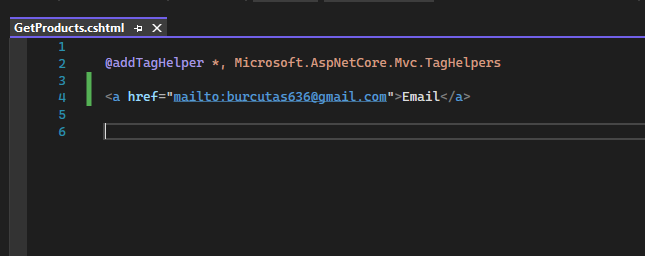
  

Özel bir tag helper, html helper'larda olduğu gibi extension olarak oluşturulmazlar.

Tag helper'lar yapısal olarak bir sınıftırlar. Dolayısıyla custom bir tag helper oluşturabilmemiz için öncelikle normal bir sınıf oluşturmamız gerekecektir.

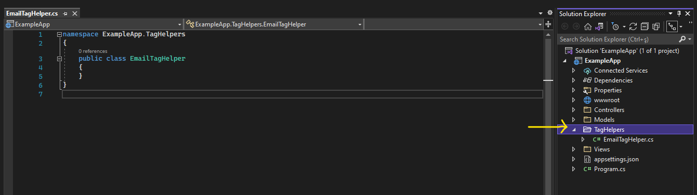
  

Oluşturduğumuz TagHelpers klasörünün altında EmailTagHelper adında bir class oluşturuyoruz. (Custom TagHelper isimlerinin sonuna "TagHelper" kelimesinin getirilmesi bir isimlendirme standartıdır.)

Bir sınıfın, tag helper sınıfı olabilmesi için class isminin sonunda "TagHelper" ifadesinin olması yeterli değildir. Bu sınıfın ayrıca TagHelper class'ından türetiliyor olması lazım.

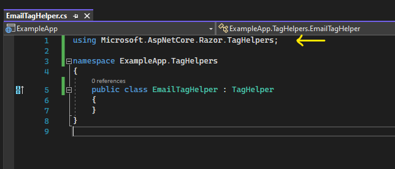
  

Şimdi oluşturduğumuz bu tag helper'ı viewde kullanabilmemiz için öncelikle tag helper'ın kütüphanesini vermeliyiz. 

Alttaki resimde @addTagHelper diye eklediğimiz kütüphane sistem tarafından dahili olarak gelen hazır tag helper'ların bulunduğu bir kütüphanedir. 

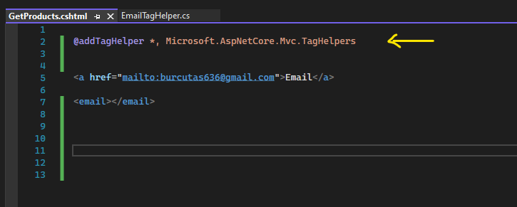
  

Bizim oluşturduğumuz tag helper'ı kullanabilmemiz için yine @addTagHelper komutuyla bizim namespace'imizin ismini eklememiz gerekecektir. 

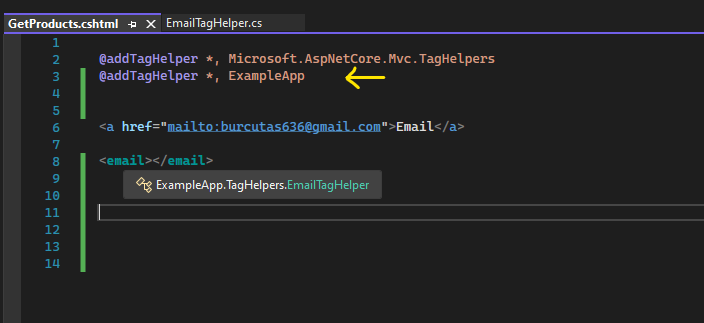

Görüldüğü üzere email tag'ı aktif hale geldi.

 

Bir tag helper, bizden aldığı değerlerle arkaplanda  oluşturacağı yapılanma neyse ona gerekli set işlemlerini yapacaktır.

Örneğin biz bu oluşturduğumuz tag helper'a "abc" değerindeki x attribute'unu verdik.

Ve dikkat ederseniz bu x attribute'u sadece bir attribute'dan ibaret. Yani bir tag helper'ın parçası olmadığı için herhangi bir vurguluk yok. 

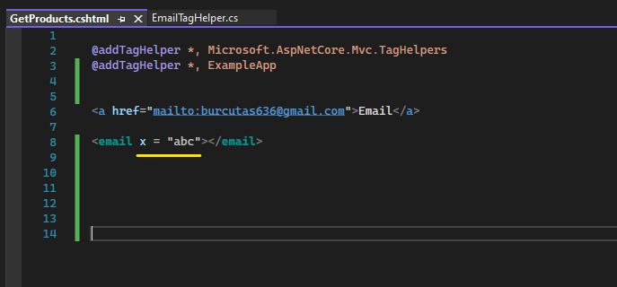
  

Bu attribute'u helper üzerinde aktifleştirebilmek / işlevsel hale getirebilmek için EmailTagHelper class'ında override etmemiz gereken bir metot olacaktır. O metot da Process() isminde bir metodudur.

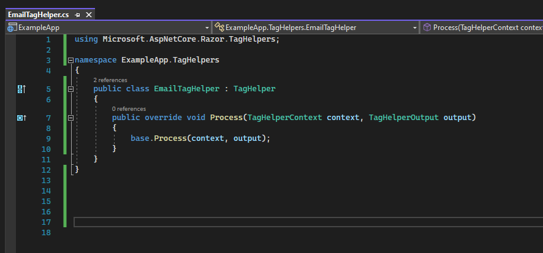
  

Uygulamayı çalıştırdığımızda ilgili tag helper tetiklendiğinde bu Process() metodu da tetiklenecektir. Bu fonksiyon, ilgili tag helper'ın işleminin yapıldığı fonksiyondur.

Process metodunun iki tane parametresi bulunmaktadır; context ve output parametreleri. Context parametresi, ilgili tag helper'a vermiş olduğumuz bütün değerleri bizlere getirirken Output parametresi bu tag helper'ın yapacağı işlemleri bize sunacaktır.

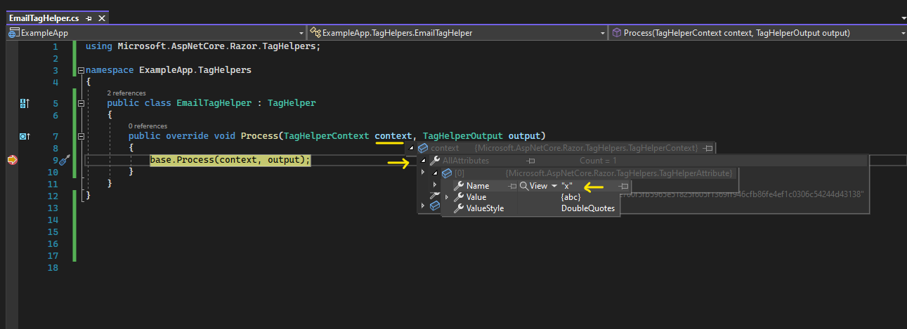

Görüldüğü üzere context'in 'attribute' parametresi üzerinden x attribute'umuza ulaşabiliyoruz.

Tag helper'daki attribute'lara sadece context'den erişmek gibi bir kısıtlama yoktur. Alternatif olarak property'ler üzerinden de bu attribute'lara erişebiliriz.

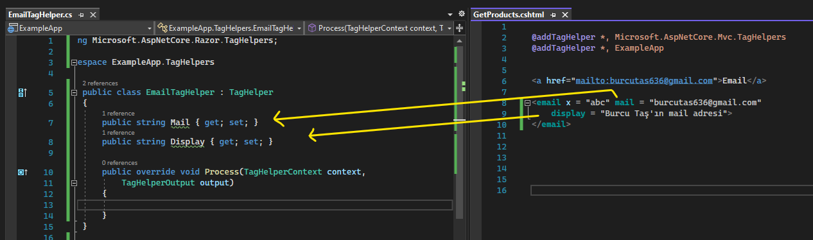

Aynı isimde olan property ve attribute'lar arkaplanda otomatik eşleştirilecektir. x değişkeninin tag helper class'ında bir property'si olmadığı için o attribute'a sadece context parametresinden ulaşabiliriz.

 

<h3>
Peki biz en baştaki a tag'ı gibi bir çıktıyı output parametresiyle nasıl oluşturabiliriz?
</h3> 

Öncelikle oluşturmak istediğimiz etiketi 'TagName' property'si ile bildiriyoruz. Bu etiketin attribute'ları olacaksa, onları 'Attributes' property'si ile belirtiyoruz. Ardından bu etiketin bir display'i olması lazım yani a etiketini görüntüleyebilmek için bir metninin olması gerekiyor. Bunun içinde 'Content' property'sini kullanıyoruz. 

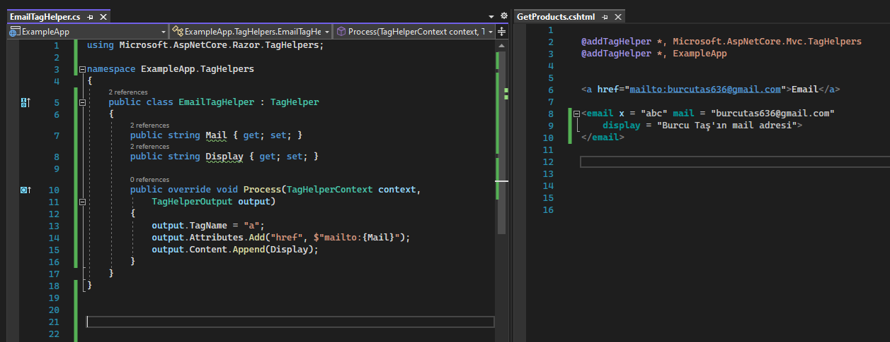
  

Ve uygulamayı çalıştırdığımızda aşağıdaki şekilde bir sonuç alacağız.

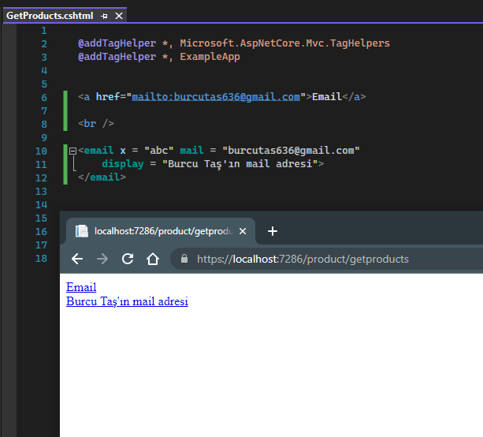
  

### Kritik

Oluşturulan tag helper'lar isimlerini, otomatik olarak kendi sınıflarından almaktadır. Ancak sınıfın ismi dışında başka bir isimle bu helper'ı kullanmak istiyorsak bu ismi [HtmlTargetElement] attribute'u üzerinden verebiliriz.

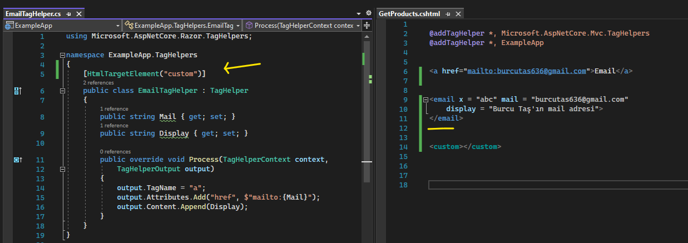

Görüldüğü üzere email tag helper'ı pasifleşirken custom tag helper aktif hale gelmiştir.

