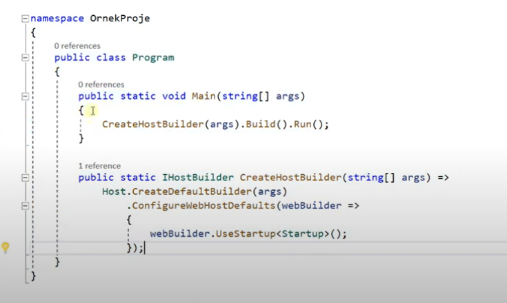

# Asp .NET Core 5.0 Dosya Yapısı

Asp .net core esasında bir console uygulamasıdır. 

Asp .net core kendi dahilinde / fıtratında bir sunucu (Kestrel) barındırır. İşte bu sunucuyu ayağa kaldırdığı nokta Program.cs dosyasıdır.

 
 

Program.cs içerisinde, ayağa kaldırılacak olan host'un kullanacağı konfigürasyonları nereden alacağını bildirir. 

Asp .net core 5.0 sürümünde Startup.cs dosyası kullanılıyor ancak .net 6 sürümünden itibaren Startup.cs dosyası, Program.cs dosyasıyla birleştirilmiştir. Bu yüzden .net 6 sürümü ve sonraki sürümlerde Startup.cs dosyası ile karşılaşmıyoruz. 

Startup.cs sınıfı, temel konfigürasyon sınıfıdır.

 
 

ConfigureServices() metodu, uygulamada kullanılacak servislerin eklendiği / konfigüre edildiği metottur.

- Servis nedir? 

Belirli işlere odaklanmış ve o işin sorumluluğunu üstlenmiş kütüphanler / sınıflardır.

Servis, modül, kütüphane bunlar aynı anlamlara gelmektedir.

Configure() metoduyla uygulamada kullanılacak olan middleware'ları / ara katmanları / ara yazılımları çağırmaktayız.

appsettings.json Dosyası: Uygulamada belirli static değerleri tuttuğumuz bir konfigürasyon dosyasıdır.

 
 

Bazen yazılımlarımızda, uygulamanın her yerinde kullanmak isteyeceğimiz metinsel değerler olabilir. (Örn. veri tabanı bağlantı stringi)

Yazılımlarda kullanılması gereken static olan metinsel değerler kodun içerisine yerleştirilmez. Çünkü günün birinde bu değerin değiştirilmesi gerektiğinde kodun yer yerinde düzeltme yapılması gerekecektir. 

- Dependencies nedir? 

Uygulamada kullandığımız harici ve dahili kütüphanelerdir. 

Bir uygulamayı kestrel'de ya da IIS'de ayağa kaldırabiliriz

 
 

Görseldeki açılan seçeneklerde projenin ismiyle aynı olan seçenek kestrel'dir. 

