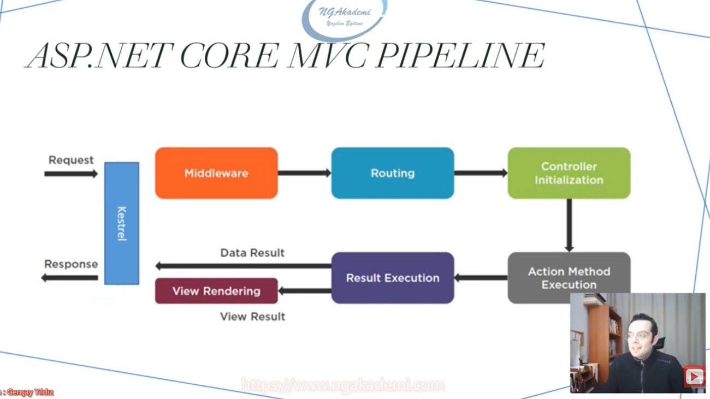

# MVC (Model View Controller) Nedir?

MVC, birbirinden bağımsız üç katmanı esas alan mimarisel bir desen (Architectural Pattern)'dir. Kimi kaynaklarda tasarım desenidir diye de geçmektedir. Ancak aslında bir tasarım deseninden daha fazlasıdır.

Çünkü design dediğimiz tasarım desenleri belirli senaryolara uygun yerleştirilip kullanılırken mimarisel desenler ise genel yaklaşımımızı belirlerler.

Örneğin, bağımsızlık senaryolarında dependency injection desenini kullanırız. Bu bir mimari değildir, bunun üzerine bir mimari geliştirmeyiz. Bu tasarım deseni ilgili senaryo ihtiyacında kullanılır.

Ancak mimarisel desen, tasarım deseninden daha geniş kapsamlı olduğu için içinde bir veya birden fazla tasarım deseni barındırabilen desenlerdir.

 

Mvc; özünde observer, decorator gibi design pattern'ları kullanan mimarisel bir desendir.  

Microsoft, bu desen üzerine oturtulmuş Asp .Net Core Mvc mimarisini geliştirmiştir.

 

<h2>Model katmanı</h2>

Model katmanı, işlenecek olan veriyi temsil eden katmandır. Genellikle veri tabanı işlemlerinin yapıldığı katmandır. (Örn. Entity Framework Core, Entity Modals, Ado .Net, Repository, veri tabanı işlemleri...)

Yani veri, mvc'de ayrı bir katmanda işlenen, ayrı bir katman olarak nitelendirilen bir değer, bir olgudur. 

 

<h2>View katmanı</h2>

İstek neticesinde elde edilen verileri görselleştirecek, görsel çıktısını verecek katmandır. (Örn. html, css, javascript, razor, resim, müzik, video)

 

<h2>Controller katmanı</h2>

Gelen request'leri karşılayacak olan ve request'in içeriğine göre gerekli model işlemlerini üstlenecek olan katmandır. 

Algoritmaları, servisleri, veri tabanını vs. çağırarak / çalıştırarak/ sorgulayarak istenilen veriyi üretmekten ve ihtiyaç dahilinde üretilen bu veriyi view ile görselleştirmekten sorumludur. 

İstek neticesinde elde edilen ve işlenen veriyi tekrar client'a response olarak döndürülür.

Controller, veriyi üretmekten sorumludur.

  

<h2>MVC Çalışma Mantığı</h2>

User, client üzerinden bir istekte bulunuyor ve isteği karşılayan controller isteğin mahiyetine bakıyor. 

Bu istekte, bir veri tabanı ihtiyacı varsa ya da veriler dış kaynaktan alınacaksa ya da bir model kullanılacaksa istek model'a yönlendiriliyor. Yani model'dan bu istenilen verinin üretilmesi isteniyor ve model'da bu verileri üreterek controller'a gönderiyor. 

Şimdi veriler controller'da. Eğer bu veriler üzerinde belirli bir görsellik işlemi yapılacaksa veri, view katmanına gönderiliyor. Ve tekrardan bu işlenilen / render edilen veriler controller'a gönderiliyor. En sonunda da elde edilen bu sonuçlar controller'dan client'a gönderiliyor.

  

<h2>Peki Asp .Net Core MVC'de bir request nasıl işleniyor?</h2>
 

  

Gönderdiğimiz isteği kestrel sunucumuz karşılayacak ve middleware yapıları devreye girecek. Daha sonra routing katmanına gelinecek.  

Routing aşamasında, request'in hangi endpoint'i yani hangi isteği yaptığını yüzlerce controller'ın / istek alanının arasından bulacak ve o endpoint'e yönlendirecek.

Bundan sonra ilgili controller ayağa kaldırılıp bu controller'ın içerisindeki action method'lardan, isteği karşılayabilecek olan method çalıştırılacak. 

Ardından bu üretilen sonuç ya direkt client'a gönderilecek ya da view'e gönderilip render edildikten sonra elde edilen sonuç client'a gönderilecek. 

