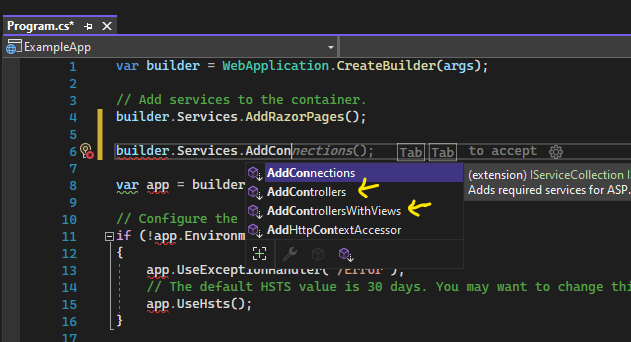
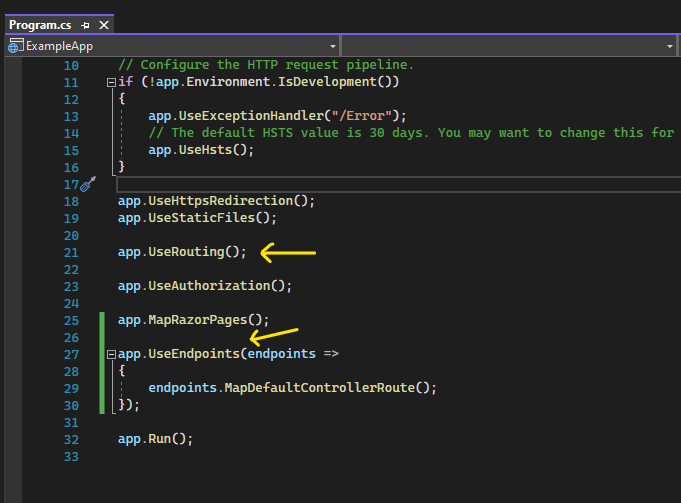
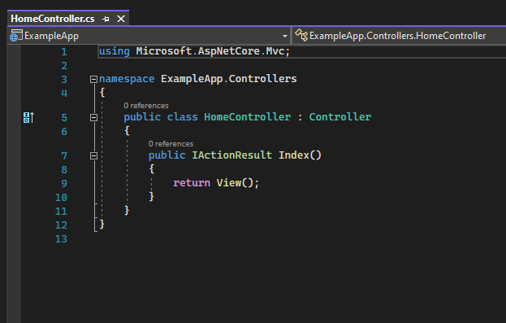
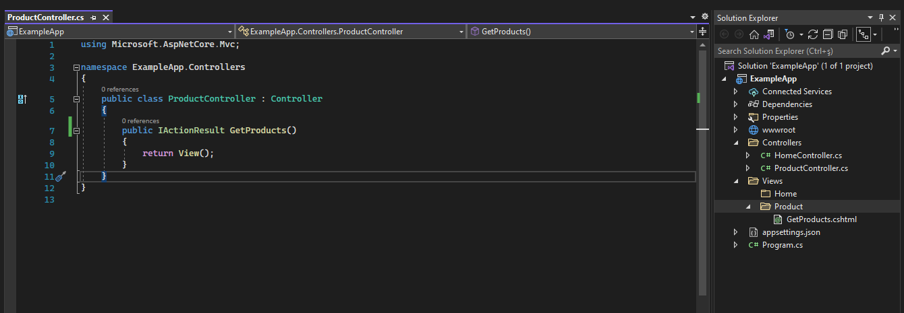
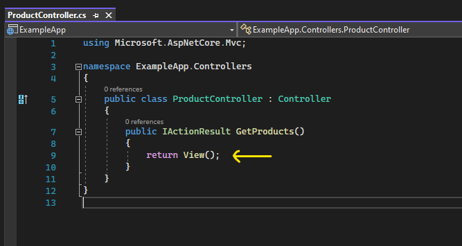
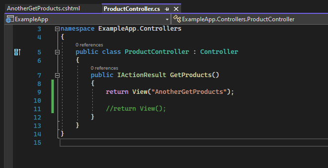
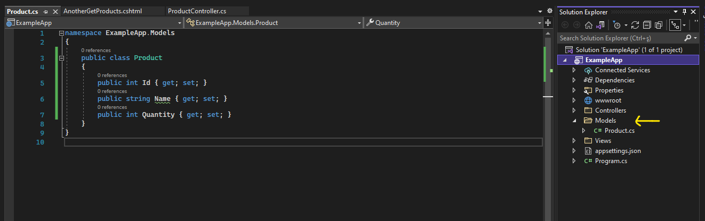

# MVC Proje Altyapısı Oluşturmak ve Temel Konfigürasyonları Sağlamak

Asp .net uygulamasında, Mvc mimarisini kullanabilmek için uygulamaya mvc'yi servis olarak eklememiz gerekmektedir.

Program.cs dosyasındaki Services property'si üzerinden servisimizi yani mvc mimarimizi uygulamaya ekliyoruz. 

Mvc mimarisini ekleyebilmemiz için AddControllers() metodunu ya da AddControllersWithViews() metodunu çağırmamız gerekiyor.

Eğer ki mvc'de istekleri alan controller'ı kullanacaksak AddControllers() metodunun ekli olması gerekiyor. 

Yok eğer view katmanını da kullanacaksak o zaman AddControllersWithViews() metodunu eklememiz gerekiyor.

  

UseRouting() metodu: Gelen isteğin, hangi controller'ın metodunu çağıracağı bu metotla belirliyor. Yani gelen isteğin rotasını bu middleware belirliyor.

UseEndpoints() metodu: Yapmış olduğumuz isteğin ta kendisidir. İstek yapılacak adresi temsil eder.

Bu uygulamaya gelen isteklerin hangi rotalar / şablonlar eşliğinde gelebileceğini endpoints'den bildireceğiz.

  

Controller'lar özlerinde bir class'tırlar. Ve bir class'ın request karşılayabilir fıtrata sahip olabilmesi için Controller sınıfından kalıtım alması gerekir. 

Action Method: Controller sınıfları içerisinde istekleri karşılayan metotlara action metot denir.

Bir controller'ın içerisinde (erişim belirleyicisi fark etmeksizin) herhangi bir metot oluşturduğumuzda bu metotların hepsi birer action metodudur. 

Örneğin HomeController sınıfının içerisindeki Index() metodu bir action metodudur. Sebebi ise geri dönüş tipinin IActionResult olması değildir. Bu sınıf Controller sınıfından türetildiği için içerisindeki bütün metotlar action metodu olarak kabul edilecektir.

Eğer Controller sınıfından türetilmeseydi o zaman normal bir metot görevi görecekti, action metot olmayacaktı.

  

Bir metodun view'ini oluşturmak için Views klasörünü kullanmalıyız.

Bir controller'a ait view'lerin hepsi, ilgili controller isminin altında bulunması gerekiyor. Örneğin ProductController'a ait bütün view'ler, Product klasörünün altında olması gerekiyor.

Mesela ProductController içerisindeki GetProducts() action'ının view'i, action ismiyle aynı olmalıdır.

View dosyaları .cshtml uzantılı dosyalardır. 

c sharp + html = .cshtml ==>  Bu formata Razor teknolojisi denir.

Razor teknolojisi, asp .net veya asp .net core mvc mimarisinde view'i kodlayabilmek, view'da hızlı bir şekilde UI tabanlı çalışmalar gerçekleştirebilmek için geliştirilmiş bir teknolojidir. 

Html içerisinde c# kodlarını yazmamızı sağlayan bir teknolojidir. 

  

View fonksiyonu, bu action'a ait view (.cshtml) dosyasını tetikleyecek olan fonksiyondur.

  

Eğer ilgili action ismiyle birebir aynı olan view'i tetiklemek istemiyorsak View() overload'u olan metodu kullanarak belirtilen view ismindeki dosyayı render edebiliriz. 

  

Models klasörünün içinde Context'imiz olur (entity framework'deki), entity'lerimiz olur yani veri tabanı ile ilgili işlemler burada yapılır.

Bir veri tabanı sorgusu yazmak istiyorsak ya da bir entity'e ihtiyacımız varsa bu işleme "Models'a gitmek" denir.

